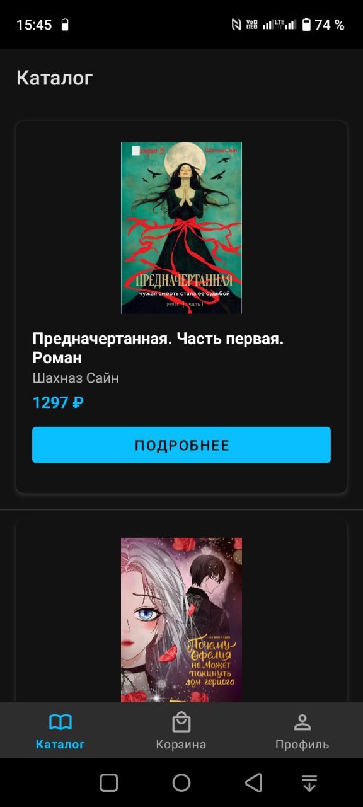
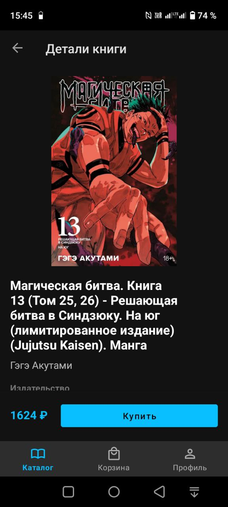
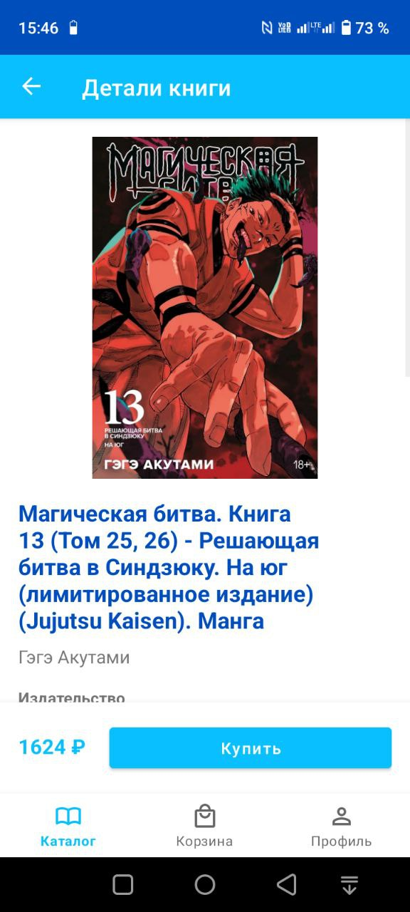
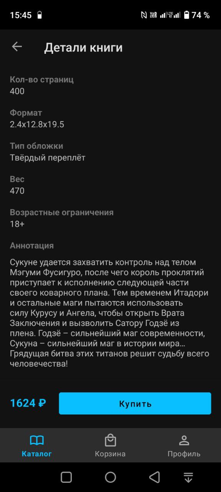
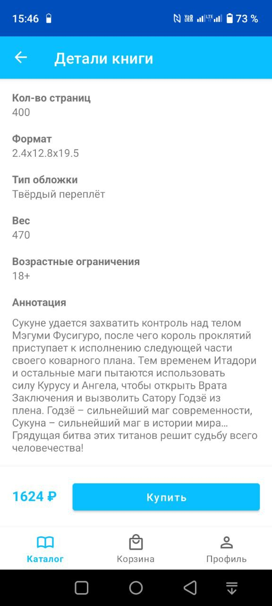
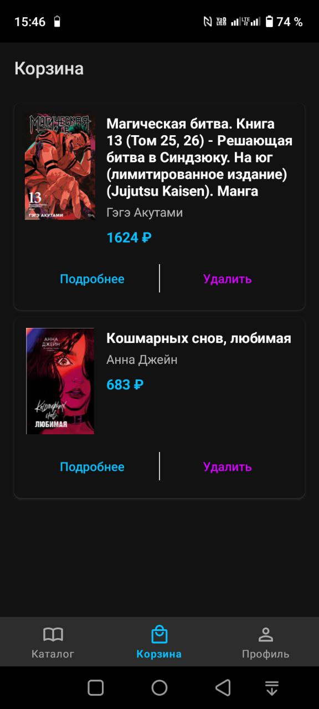
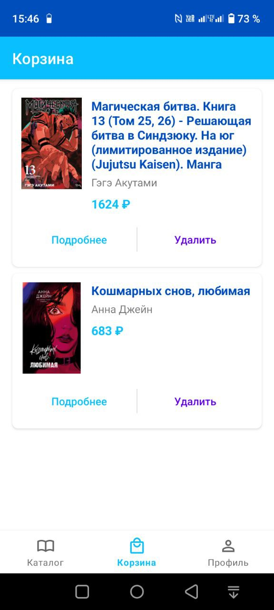
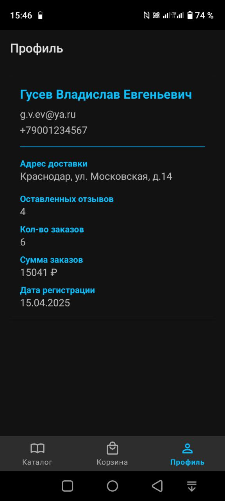
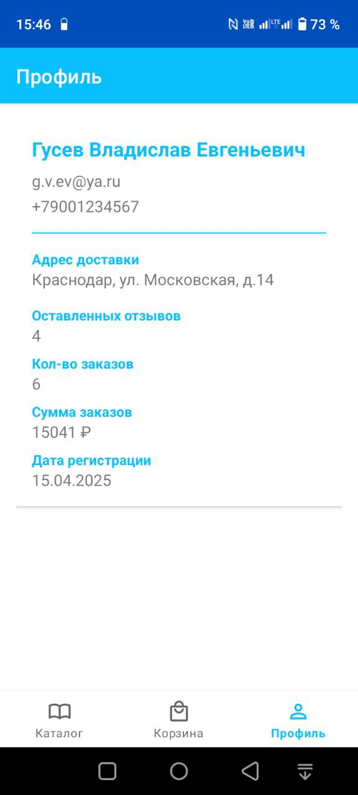

# Разработка мобильного приложения книжного интернет-магазина 
## Стек
Android Studio + Kotlin + JSON + PHP + API + SQL

## Макет приложения в Figma
https://www.figma.com/design/mAU1ji2XYCKmGfb8nHXyJl/%D0%A3%D0%BB%D0%93%D0%A3.-%D0%9C%D0%B0%D0%BA%D0%B5%D1%82-%D0%BF%D1%80%D0%B8%D0%BB%D0%BE%D0%B6%D0%B5%D0%BD%D0%B8%D1%8F

## Скриншоты

