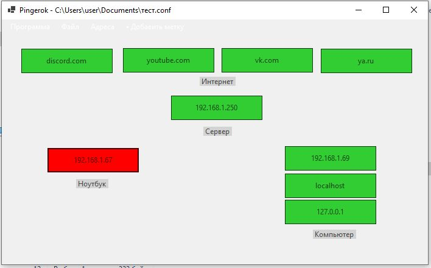

# Pingerok
Пингует хосты и визуально показывает их доступность

## Возможности
- [Вкл/Выкл] Режим позиционрированию (позволяет двигать блоки)
- [Вкл/Выкл] Полный экран (Отображается во весь экран, скрывает панель задач и бордюр программы)
- [Вкл/Выкл] Темная тема (Программа меняет цветовые оттенки со светлых на темные)
- Файл ► Открыть (Предлагает выбрать .conf файл)
- Файл ► Сохранить (Сохраняет изменения в ранее открытый файл)
- Файл ► Сохранить как (Предлагает сохранить изменения в файл)
- Адреса (Открывает форму со списком адресов и хостов)
- Адреса ► Добавить (Открывает форму для добавения адреса или хоста)
- Адреса ► Удалить (Удаляет выбранный из списка адрес или хост)
- Добавить метку (Открывает форму добавления надписи)
- Выход (закрывает программу)


## Файл.conf
Хранит в себе адреса, хосты метки и их позицию в формате;
>{тип},{адрес},{X pos},{Y pos}

Пример:
```
IP,192.168.1.250,138,15
LABEL,Сервер,187,66
```

## Скриншоты


