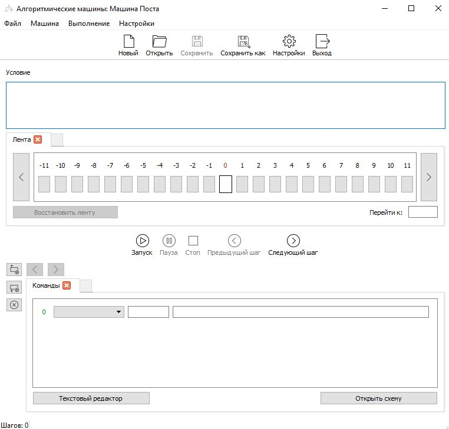
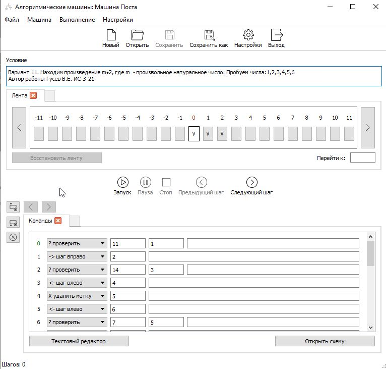
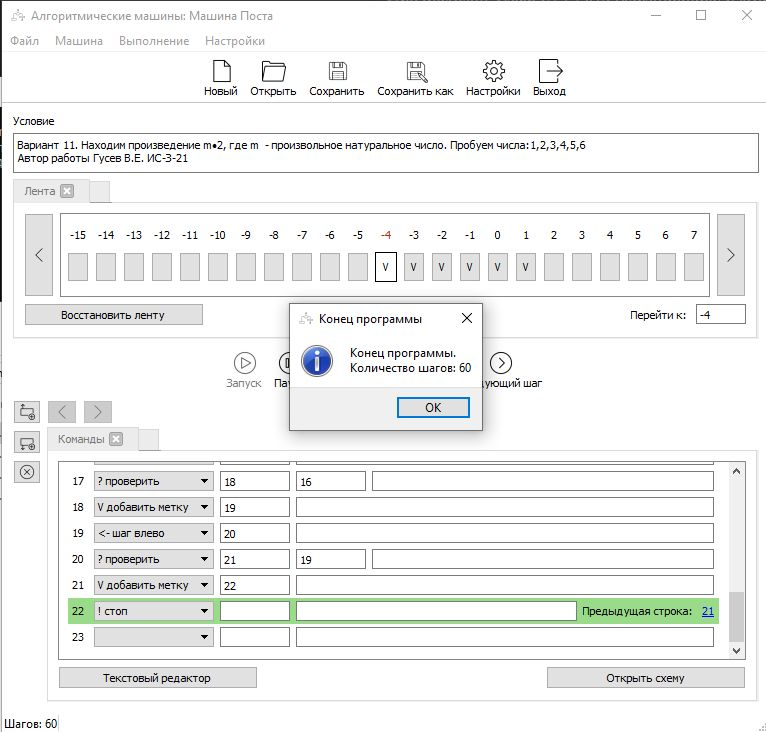
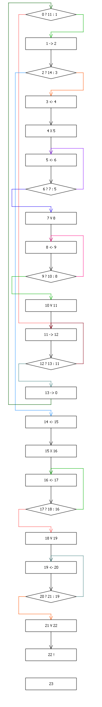

# Алгоритм на машине Поста
## Требования для запуска программы
* Microsoft Visual C++ 2013 Redistributable
* JAVA

## Задача
Находим произведение m•2, где m  - произвольное натуральное число

## Скриншоты
Запуск программы (Windows - win32.bat/win64.bat, Linux - linux32/linux64)

Открываем алгоритм `alg.amp`

Запускаем алгоритм

Схема алгоритма

