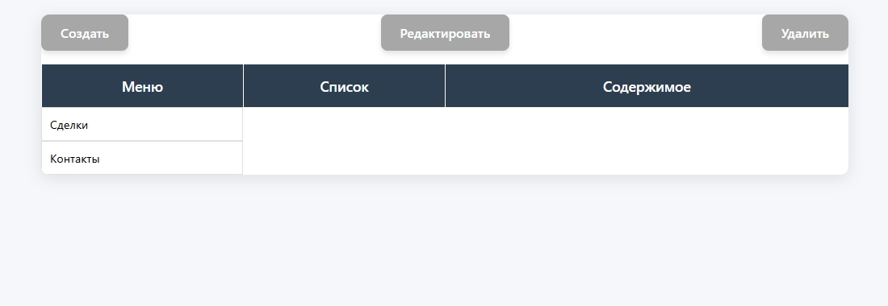
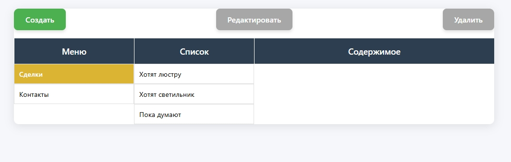
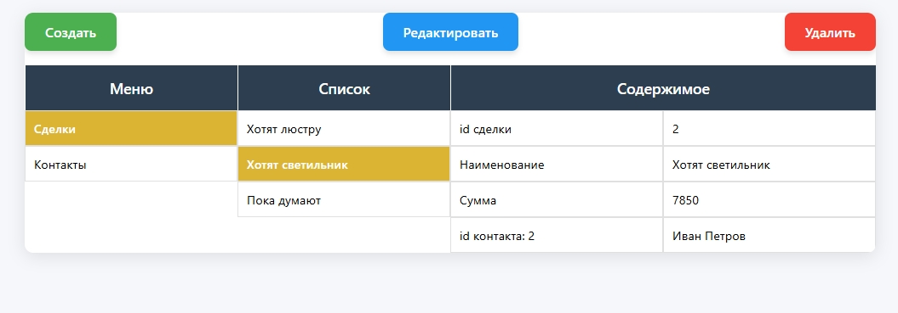
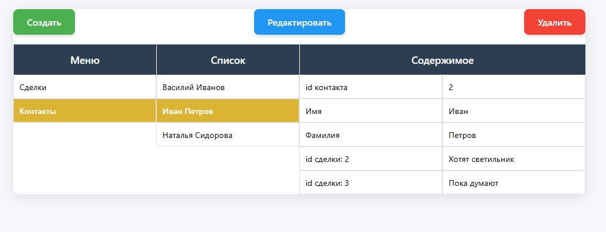
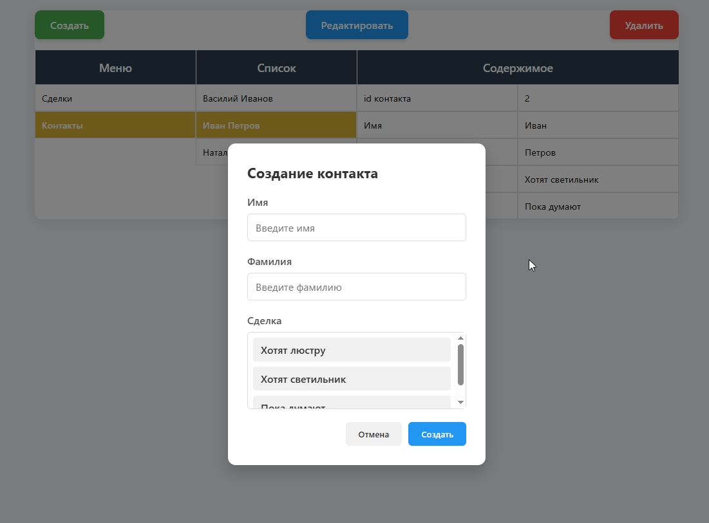
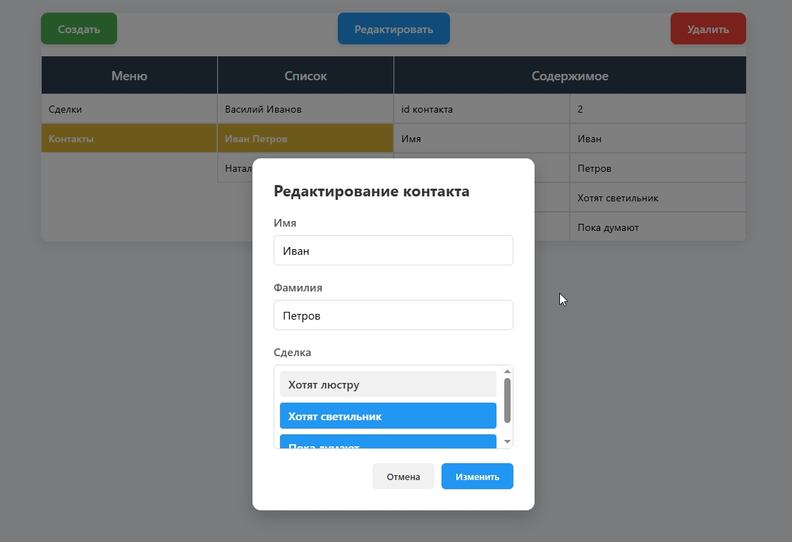
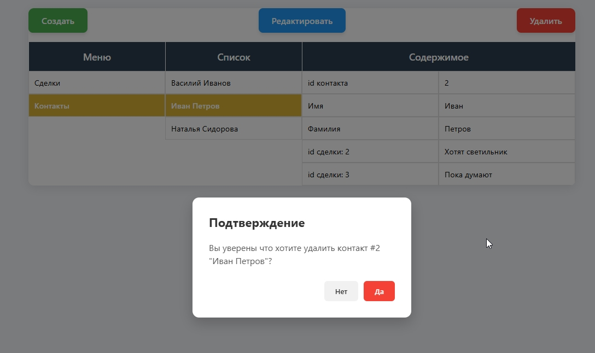

# "CMS-lite"
PHP + HTML + CSS + JS


## Скриншоты








# API

## Menu
`GET api/engine.php`

Ожидаемый ответ:
```
{
    "ok": true,
    "menu": [
        {
            "name": "Сделки",
            "resource": "deals"
        },
        {
            "name": "Контакты",
            "resource": "contacts"
        }
    ]
}
```

## Deals
Сделки.

### GET
Получает все либо одну конкретную сделки.

#### >1

Обязательные GET-параметры:
* `resource` = `deals`


`GET api/engine.php?resource=deals`

Ожидаемый ответ:
```
200
{
    "ok": true,
    "deals": [
        {
            "id": 1,
            "name": "Хотят люстру",
            "price": 4999,
            "contacts": []
        },
        {
            "id": 2,
            "name": "Хотят светильник",
            "price": 7850,
            "contacts": [
                2
            ]
        },
        {
            "id": 3,
            "name": "Пока думают",
            "price": 0,
            "contacts": [
                2,
                3
            ]
        }
    ]
}
```
#### ==1

Обязательные GET-параметры:
* `resource` = `deals`
* `id` = `{int}`


`GET api/engine.php?resource=deals&id={int}`

Ожидаемый ответ:
```
200
{
    "ok": true,
    "deal": {
        "id": 2,
        "name": "Хотят светильник",
        "price": 7850,
        "contacts": [
            {
                "id": 2,
                "first_name": "Иван",
                "last_name": "Петров"
            }
        ]
    }
}
```

### POST
Создает новую сделку.

Обязательные GET-параметры:
* `resource` = `deals`


`POST api/engine.php?resource=deals`

Ожидаемый ответ:
```
201
{"ok":true}
```

### PUT
Редактирует существующую сделку.

Обязательные GET-параметры:
* `resource` = `deals`
* `id` = `{int}`


`PUT api/engine.php?resource=deals&id={int}`

Ожидаемый ответ:
```
200
{"ok":true}
```
### DELETE
Удаляет существующую сделку.

Обязательные GET-параметры:
* `resource` = `deals`
* `id` = `{int}`


`DELETE api/engine.php?resource=deals&id={int}`

Ожидаемый ответ:
```
204
```

## Contacts
Контакты.

### GET
Получает все либо одну конкретную сделки.

#### >1

Обязательные GET-параметры:
* `resource` = `contacts`


`GET api/engine.php?resource=contacts`

Ожидаемый ответ:
```
200
{
    "ok": true,
    "contacts": [
        {
            "id": 1,
            "first_name": "Василий",
            "last_name": "Иванов",
            "deals": []
        },
        {
            "id": 2,
            "first_name": "Иван",
            "last_name": "Петров",
            "deals": [
                3,
                2
            ]
        },
        {
            "id": 3,
            "first_name": "Наталья",
            "last_name": "Сидорова",
            "deals": [
                3
            ]
        }
    ]
}
```
#### ==1

Обязательные GET-параметры:
* `resource` = `contacts`
* `id` = `{int}`


`GET api/engine.php?resource=contacts&id={int}`

Ожидаемый ответ:
```
200
{
    "ok": true,
    "contact": {
        "id": 2,
        "first_name": "Иван",
        "last_name": "Петров",
        "deals": [
            {
                "id": 2,
                "name": "Хотят светильник"
            },
            {
                "id": 3,
                "name": "Пока думают"
            }
        ]
    }
}
```

### POST
Создает новую сделку.

Обязательные GET-параметры:
* `resource` = `contacts`


`POST api/engine.php?resource=contacts`

Ожидаемый ответ:
```
201
{"ok":true}
```

### PUT
Редактирует существующую сделку.

Обязательные GET-параметры:
* `resource` = `contacts`
* `id` = `{int}`


`PUT api/engine.php?resource=contacts&id={int}`

Ожидаемый ответ:
`
200
{"ok":true}
`
### DELETE
Удаляет существующую сделку.

Обязательные GET-параметры:
* `resource` = `contacts`
* `id` = `{int}`


`DELETE api/engine.php?resource=contacts&id={int}`

Ожидаемый ответ:
```
204
```
