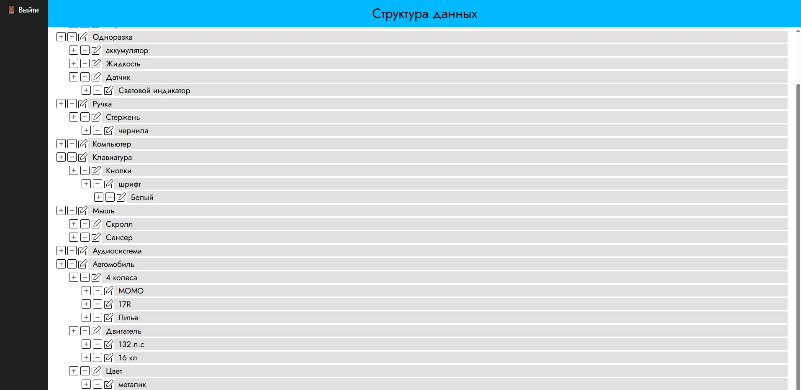
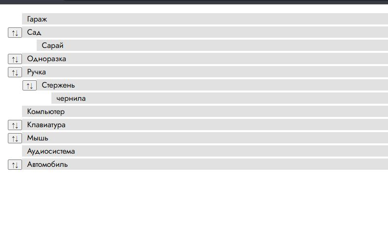

# Задача

## Стек
HTML + CSS + JS + PHP + SQL

## Описание
Необходимо создать две страницы:
1. для просмотра пользователями
2. для администратора

### Страница администратора
1. Вход на страницу администрирования осуществляется только авторизованными
пользователями по логину и паролю. Логин и пароль хранятся в базе данных,
причем пароль – в зашифрованном виде.
2. В случае успешной авторизации, администратор допускается до редактирования
«структуры данных». «Структура данных» представляет из себя дерево объектов,
состоящих из двух полей:
- название,
- описание.
  
Каждый объект может являться потомком другого объекта и быть родителем
других объектов. При этом родитель у объекта только один, а потомков
неограниченное множество. Глубина дерева не ограничена. Объекты, не имеющие
родителей, являются корневыми.
Объекты хранятся в базе данных.
3. Администратор видит текущее состояние «структуры данных», при этом визуально
обозначена иерархия объектов в дереве (например, количеством отступов слева в
зависимости от уровня вложенности объекта).
4. С помощью находящихся на странице форм администратор имеет возможность:
- добавлять объект на любой уровень дерева;
- удалять любой объект, при этом если у удаляемого объекта имеются потомки, то
они также удаляются;
- редактировать любой объект, изменяя его название, описание или родителя.
Все произведенные изменения сохраняются в базе данных.
5. Нажав на соответствующую кнопку, администратор может разлогиниться, покинув
страницу администрирования.

### Страница пользователя
1. Страница открыта для всех и на ней в виде дерева отображается «структура
данных», заведенная администратором на странице администрирования. Иерархия
объектов отображается визуально, при этом показаны только названия объектов.
2. По умолчанию отображаются только корневые объекты. Если у какого-то из
объектов имеются потомки, то справа от его названия отображается иконка
(например, плюс), при нажатии на которую показываются потомки первого уровня
данного объекта. Если у какого-то из потомков первого уровня в свою очередь
имеются потомки, то они также отображаются только после нажатия на иконку
справа от названия их родителя. Это правило действует для объектов любого
уровня.
3. При нажатии на название объекта в отдельном блоке на странице (например,
справа от дерева) отображается его описание. Если описания нет, то блок
отображается пустым.

## Скриншоты

