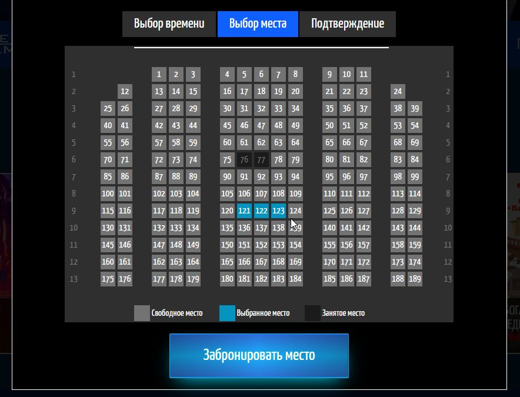

# Сайт кинотеатра с онлайн-бронированием
Дипломный проект

## Описание и содержание
* Слайдер (карулесь) фильмов на главной странице
* Фильтр по возрастному ограничение и жанру
* Схема кинозала со свободными и забронированными местами
* Если время сеанса прошло (относительно текущего времени), то осуществить бронирование на это время не предоставляется возможным
* Цена одного билета зависит от времени сеанса: утренее, дневное, вечернее, ночное
* Вход на сайт через VKID
* История аккаунта (первый вход на сайт, бронь и т.д.)
* Отображение в профиле пользователя предстоящих сеансов

Меню администратора:
* Изменение фона сайта
* Просмотр и добавление новых фильмов
* Список пользователей сайта
* Фунция "Ближайший сеанс" (относительно текущего времени)
* Бронирование через меню оператора
* Подтверждение\удаление брони
* Поиск брони по коду
* График доходов (Ожидаемая(все брони) и фактическая(только подтвержденные брони) ветка) текущей и прошлой недели

## Стек
HTML + CSS + JS + PHP + SQL + API

## Скриншоты

